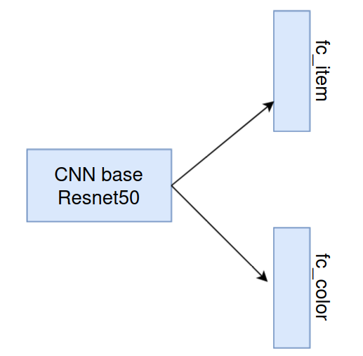

# [PYTORCH] Object Detection & Classification (with two header) using YOLO and CNN

 <h1 align="center">MultiLabel-YOLO</h1>

## Introduction
This project integrates object detection (YOLO) and image classification (CNN) to identify and classify objects in videos. 
The system first detects objects using YOLO, crops the detected regions, and then classifies them based on their type and color using a custom-trained CNN model.
## Descriptions
* Object Detection: finetune yolov8n
* Classification: A ResNet50-based CNN model  

   

* End-to-End Pipeline: Combines detection and classification into a single workflow.

   
  <i>Camera app demo</i>

